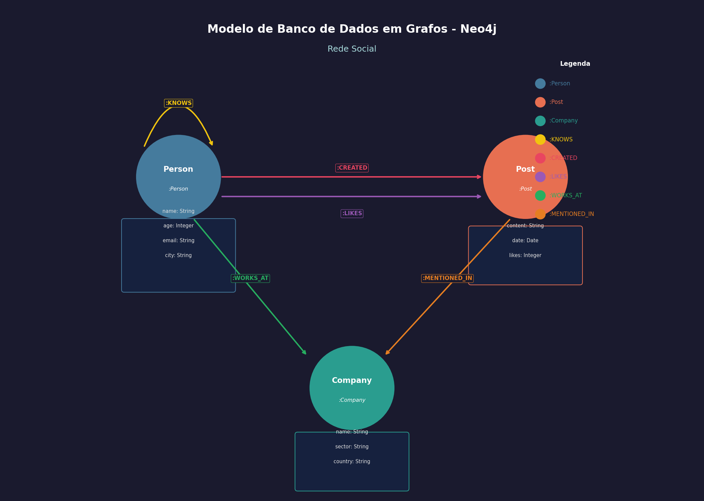

# projeto-dio-neo4j

Projeto criado para o bootcamp da plataforma **Neo4j** da **DIO** (Digital Innovation One), com foco em banco de dados em grafos.

## 📌 Descrição

Este projeto implementa um modelo de **Rede Social** utilizando o banco de dados em grafos Neo4j. O objetivo é demonstrar como grafos são ideais para representar relacionamentos complexos, como amizades, curtidas, vínculos profissionais e menções em publicações.

## 🗂️ Modelo do Banco de Dados



### Nós (Nodes)

| Label | Propriedades |
|-------|-------------|
| `:Person` | `name` (String), `age` (Integer), `email` (String), `city` (String) |
| `:Post` | `id` (String), `content` (String), `date` (Date), `likes` (Integer) |
| `:Company` | `name` (String), `sector` (String), `country` (String) |

### Relacionamentos (Relationships)

| Relacionamento | De → Para | Propriedades |
|----------------|-----------|--------------|
| `:KNOWS` | `Person → Person` | `since` (Date) |
| `:CREATED` | `Person → Post` | — |
| `:LIKES` | `Person → Post` | — |
| `:WORKS_AT` | `Person → Company` | `role` (String), `since` (Date) |
| `:MENTIONED_IN` | `Person → Post` | — |

## 📁 Estrutura do Projeto

```
projeto-dio-neo4j/
├── modelo_bd.png               # Diagrama visual do modelo de dados
├── scripts/
│   ├── 01_create_db.cypher     # Criação de constraints e índices
│   ├── 02_populate_db.cypher   # Criação de nós e relacionamentos
│   └── 03_queries.cypher       # Queries de demonstração
└── README.md
```

## 🚀 Como Executar

### Pré-requisitos

- [Neo4j Desktop](https://neo4j.com/download/) ou [Neo4j AuraDB](https://neo4j.com/cloud/platform/aura-graph-database/) (versão 5.x ou superior)

### Passo a Passo

1. **Crie um novo banco de dados** no Neo4j Desktop ou AuraDB.

2. **Abra o Neo4j Browser** e execute os scripts na ordem:

   ```cypher
   // Passo 1: Criar constraints e índices
   // Cole e execute o conteúdo de scripts/01_create_db.cypher
   
   // Passo 2: Inserir dados
   // Cole e execute o conteúdo de scripts/02_populate_db.cypher
   
   // Passo 3: Executar queries de demonstração
   // Cole e execute qualquer query de scripts/03_queries.cypher
   ```

3. **Visualizar o grafo completo:**

   ```cypher
   MATCH (n) RETURN n LIMIT 50;
   ```

## 🔍 Queries de Demonstração

O arquivo [`scripts/03_queries.cypher`](./scripts/03_queries.cypher) contém 12 queries comentadas que demonstram:

| # | Query | Demonstra |
|---|-------|-----------|
| 1 | Listar todas as pessoas | Consulta básica de nós |
| 2 | Posts e seus autores | Travessia de relacionamento `:CREATED` |
| 3 | Amigos diretos de Alice | Padrão de busca por vizinhança direta |
| 4 | Amigos de amigos | Travessia em múltiplos níveis (`[:KNOWS*2]`) |
| 5 | Caminho mais curto | Algoritmo `shortestPath()` |
| 6 | Top 5 posts mais curtidos | Ordenação e limitação de resultados |
| 7 | Pessoas com curtidas em comum | Padrão de intersecção de grafos |
| 8 | Colegas de trabalho | Relacionamento via nó intermediário |
| 9 | Grau de conexões por pessoa | Contagem de relacionamentos (grau do nó) |
| 10 | Estatísticas gerais | Aggregation em todo o grafo |
| 11 | Recomendação de conexões | Caso de uso de redes sociais com grafos |
| 12 | Empresa com mais funcionários | Agregação por nó intermediário |

## 🧩 Tecnologias

- **Neo4j** — Banco de dados orientado a grafos
- **Cypher** — Linguagem de consulta do Neo4j

## 📚 Referências

- [Documentação Neo4j](https://neo4j.com/docs/)
- [Cypher Manual](https://neo4j.com/docs/cypher-manual/current/)
- [DIO — Digital Innovation One](https://www.dio.me/)
